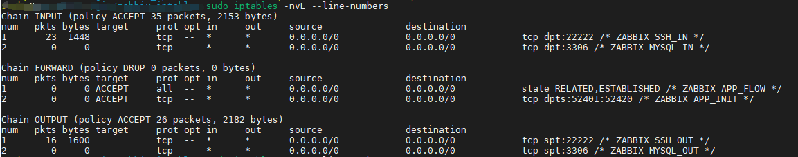
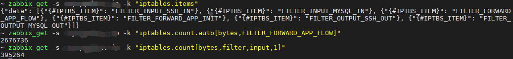
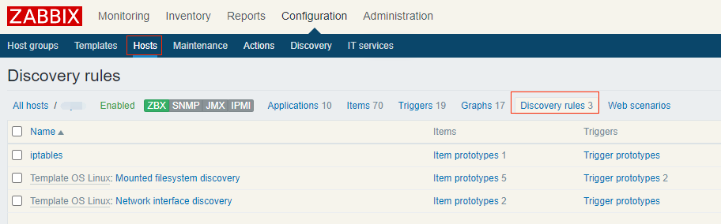
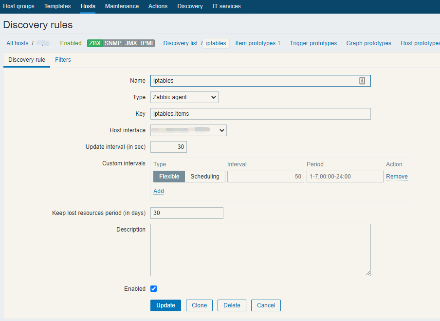
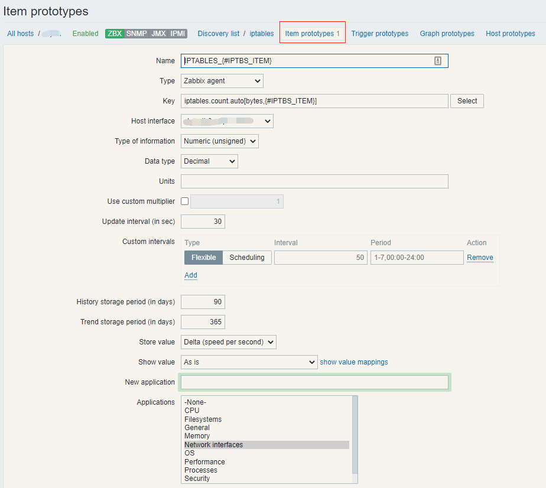
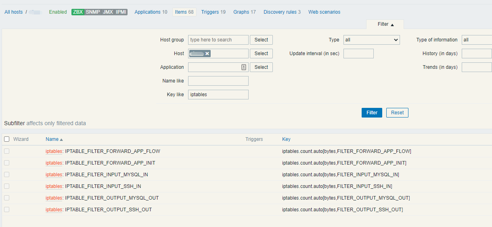
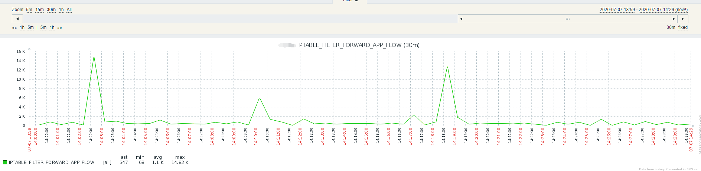

## Description
Monitor designated packets/bytes of items in iptables by zabbix, such as tcp/udp port flow.

Discovery items need be monitored automatically.


## Depoly

### Client

#### Install the script

`sudo cp zabbix_iptables.py /usr/bin/`
`sudo chmod a+x /usr/bin/zabbix_iptables.py`


#### Grant privilege 

The script will be run as user **zabbix**, and invokes command 'iptables' which requires **root privilege**,  There are some ways to privilege non-root users.

a. Set SUID to iptables

`sudo chmod 4744 /sbin/iptables`

OR

b. Grant sudo privilege to user **zabbix**  without password by edit /etc/sudoers

`zabbix    ALL=(ALL:ALL) NOPASSWD: ALL`

 Then add sudo prefix to zabbix_agent config.

`UserParameter=iptables.items[*],sudo /usr/bin/zabbix_iptables.py`


#### Add config in zabbix_agent

`sudo vi /etc/zabbix/zabbix_agentd.conf.d/zabbix_iptables.conf`

```
UserParameter=iptables.items[*],/usr/bin/zabbix_iptables.py
UserParameter=iptables.count[*],/usr/bin/zabbix_iptables.py --unit $1 --table $2 --chain $3 --comment $4
UserParameter=iptables.count.auto[*],/usr/bin/zabbix_iptables.py --unit $1 --key $2
```

| api                 | function                |
| ------------------- | ----------------------- |
| iptables.items      | discovery items         |
| iptables.count      | get data by designation |
| iptables.count.auto | get data by discovery   |

restart zabbix_agent

`sudo /etc/init.d/zabbix-agent restart` 

#### Modify IPTABLES rules

By default, rule will discovery items with comment starts with **ZABBIX**, and name this items by their comment.

For example, the record below will be assign key as **FILTER_INPUT_SSH_IN** on zabbix server.

```
Chain INPUT (policy ACCEPT 791 packets, 55660 bytes)
num   pkts bytes target     prot opt in     out     source               destination
1    16764 1446K            tcp  --  *      *       0.0.0.0/0            0.0.0.0/0            tcp dpt:22222 /* ZABBIX SSH_IN */
```




### Server 	

#### Test client



#### Add discovery rules



#### Create rule

key = iptables.items



#### Create item prototypes

name = IPTABLE_{#IPTBS_ITEM}

key = 	iptables.count.auto[bytes,{#IPTBS_ITEM}]

Store value = Delta




## Display







## Other

if config as below, it will discovery all item whether it has comment.

`UserParameter=iptables.items[*],/usr/bin/zabbix_iptables.py --no_comment`